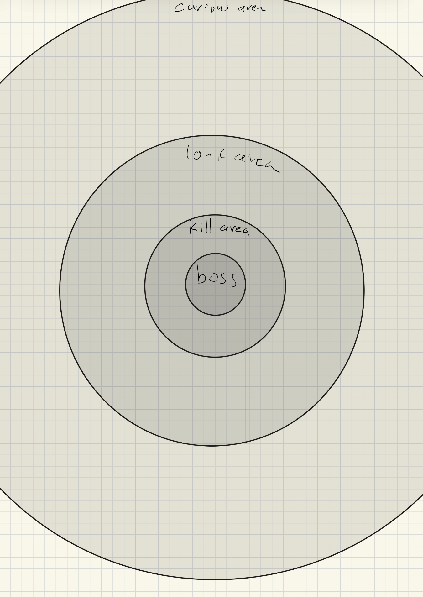
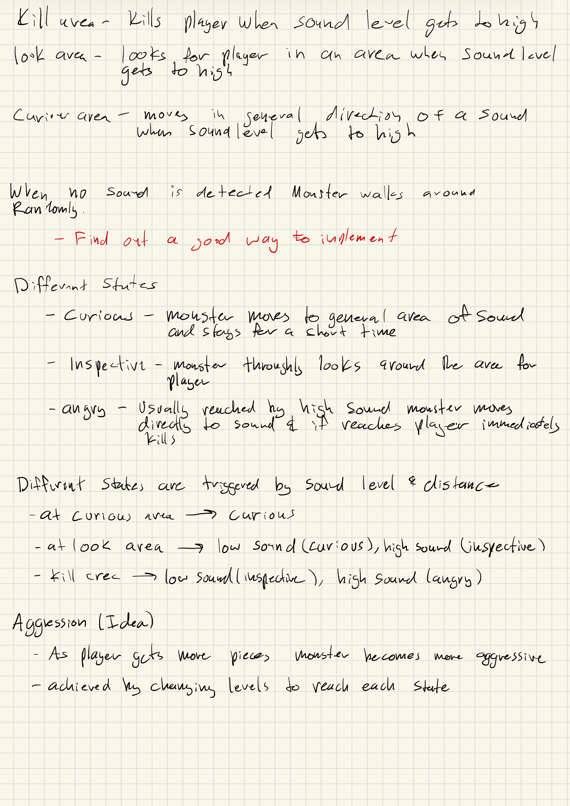

# Graveyard Shift

## Summary

**A first person 3D horror game inspired by Poppy Playtime and Five Nights at Freddy’s where you work the graveyard shift inspecting playrooms for an upcoming park launch while avoiding an animatronic name Willie.**

## Project Resources

[Web-playable version of your game](https://magicbattle.itch.io/graveyard-shift)

[Proposal](https://docs.google.com/document/d/1nR5DYf_2luAt4GnkOczyh9kR6Yd4S6YwB5Mn2vxp6f4/edit?tab=t.0#heading=h.i3tv2mxf7h7z)

## Gameplay Explanation

**In this section, explain how the game should be played. Treat this as a manual within a game. Explaining the button mappings and the most optimal gameplay strategy is encouraged.**

**Add it here if you did work that should be factored into your grade but does not fit easily into the proscribed roles! Please include links to resources and descriptions of game-related material that does not fit into roles here.**

# External Code, Ideas, and Structure

If your project contains code that: 1) your team did not write, and 2) does not fit cleanly into a role, please document it in this section. Please include the author of the code, where to find the code, and note which scripts, folders, or other files that comprise the external contribution. Additionally, include the license for the external code that permits you to use it. You do not need to include the license for code provided by the instruction team.

If you used tutorials or other intellectual guidance to create aspects of your project, include reference to that information as well.

# Team Member Contributions

This section be repeated once for each team member. Each team member should provide their name and GitHub user information.

The general structures is

```
Team Member 1
  Main Role
    Documentation for main role.
  Sub-Role
    Documentation for Sub-Role
  Other contribtions
    Documentation for contributions to the project outside of the main and sub roles.

Team Member 2
  Main Role
    Documentation for main role.
  Sub-Role
    Documentation for Sub-Role
  Other contribtions
    Documentation for contributions to the project outside of the main and sub roles.
...
```

For each team member, you shoudl work of your role and sub-role in terms of the content of the course. Please look at the role sections below for specific instructions for each role.

Below is a template for you to highlight items of your work. These provide the evidence needed for your work to be evaluated. Try to have at least four such descriptions. They will be assessed on the quality of the underlying system and how they are linked to course content.

_Short Description_ - Long description of your work item that includes how it is relevant to topics discussed in class. [link to evidence in your repository](https://github.com/dr-jam/ECS189L/edit/project-description/ProjectDocumentTemplate.md)

Here is an example:  
_Procedural Terrain_ - The game's background consists of procedurally generated terrain produced with Perlin noise. The game can modify this terrain at run-time via a call to its script methods. The intent is to allow the player to modify the terrain. This system is based on the component design pattern and the procedural content generation portions of the course. [The PCG terrain generation script](https://github.com/dr-jam/CameraControlExercise/blob/513b927e87fc686fe627bf7d4ff6ff841cf34e9f/Obscura/Assets/Scripts/TerrainGenerator.cs#L6).

You should replay any **bold text** with your relevant information. Liberally use the template when necessary and appropriate.

Add addition contributions int he Other Contributions section.

# Tanner Nguyen #

## Main Role: User Interface and Input

### Main Menu


The main menu is the first screen the user sees when playing the game. It was made using a 3D node that contains decorations such as floors, roofs, monster(Willie), etc. with a CanvasLayer displaying the UI of the title of the game and buttons to play or exit. The font used in the text and throughout is [Futura Condensed Extra Bold](https://font.download/font/futura-condensed-extra).

### Player Screen


This is the UI of the player screen with all of the essential elements of the game that are all under the main scene UI node except for Inventory and ViewModel. On the bottom left corner is the stamina bar which was created by using a ProgressBar over an icon(TextureRect) to display the sprint icon. As the player runs, the bar decreases until it is empty making the player unable to run. On the left is the ObjectiveUI which is a NinePatchRect using a black shade texture from an asset pack. It contains a HBoxContainer with the question mark icon(TextureRect) and a label that contains a objective.gd script that can change the label of the objective such as setting an objective. As you complete specific objectives in the map, the label changes to notify the player on what to do next for their objective. On the top right corner is the CodesUI that follows the same concept of the ObjectiveUI by using NinePtchRect, icon, and label to display the codes use to unlock the doors. These codes are useable to unlock specific doors in the map such as the playrooms. On the right is the ControlsUI that displays the controls of the game during the tutorial using a label. This is mainly here for the tutorial of the game to introduce the controls to the player as they first play the game. On the bottom right corner is the throwBar that follows the same creation as the stamina bar, but the bar is only shown when charging a throw on a throwable. The throw was computed in the player.gd script by using [throw_held_object](https://github.com/MagicBattle/Graveyard-Shift/blob/3c5320e4ab3b872bf6baea429921792b88145c85/-graveyard-shift/scripts/player.gd#L526C1-L555C41) which takes in the delta frame rate and listens to inputs of throw. On the slightly middle of screen with text is the DialogueLabel that can display custom text in player_screen.gd script for the player to contain dialogue throughout the game. The label also uses an AnimationPlayer that fades in and out the text displayed. Dialogue was heavily used by either completing specific actions in the game such as completing a playroom or entering a trigger zone such as entering the maze.

In the player scene contains Inventory and ViewModel. On the bottom of the screen is the inventory where the player can store throwable items to throw and distract Willie. It contains an invetory.gd and inventory_bar.gd scripts where inventory proccesses logic based on when the inventory slots changes by using signals and inventory bar updates the slots by highlighting and updating slots by loading the icon path. [Here is an example of the item path](https://github.com/MagicBattle/Graveyard-Shift/blob/e8b7ca83d098895268b258b75c70d250eb671914/-graveyard-shift/scripts/player.gd#L95-L101). Lastly, the viewmodel was created by adding a canvaslayer node containing a RayCast3D and a ViewModel node containing viewmodel.gd script under Camera3D that shows the held item by finding the first mesh instance of that item which is seen from the floating paper ball on the screen.

When pressing the 'esc' key, it will bring you to the pause menu(Not displayed on the image) that gives you an option to resume or exit the game. This is implemented by the game_manager.gd script that Dhruv created where the scene of the game freezes and displays a mouse cursor for you to interact with the UI buttons.

### Jumpscare


This is the Jumpscare scene that is triggered when you are close to Willie. It was created using Willie's mesh, background/floor mesh, and spotlight that plays a jump over animation imported by Michael. It contains a jumpscare.gd script that shakes the camera for one second by decaying the shake intensity. The Jumpscare was inspired by the [Five Nights at Freddy's 2 jumpscare](https://youtu.be/7lR98pq97f8?si=6XvnMw-qEzZGavjB&t=20) where the animatronic jumps on you, but we decided to do a run animation since it was difficult finding a jump animation for Willie.

### Death Screen


This is the death scene that triggers after the jumpscare scene. It follows the same creation of the jumpscare scene but displays a UI to continue or exit the game. The "YOU DIED" label used a different font called [Volter Black](https://www.1001fonts.com/volter-font.html) to emphasis the text more on screen. The scene also uses a blur.gdshader founded by Michael to have a VHS effect to the death similar to the Five Nights at Freddy's game.

### UI Resources

- [Texture of Objective and Codes UI](https://waxx.itch.io/shadow-mines-asset-pack)
- [Question Mark Icon](https://www.freepik.com/free-vector/black-hand-painted-question-mark_148767885.htm#fromView=keyword&page=1&position=0&uuid=f5ded46c-e42e-4591-954e-5fcfb5bade8a&query=Spooky+question+mark)
- [Sprint Icon](https://www.flaticon.com/free-icon/running_1267761?term=run&page=1&position=4&origin=tag&related_id=1267761)
- [Throw Icon](https://www.flaticon.com/free-icons/throw)
- [Main Font](https://font.download/font/futura-condensed-extra)
- [YOU DIED Font](https://www.1001fonts.com/volter-font.html)

## Sub-Role - Narrative Design

### How the Narrative was created?

With the help of our initial plan, it was hard to start on the narrative since we were still gathering assets and learning how to use Godot in 3D so I focused more on creating the UI. After we started to have a plan on how we created our game, I thought of adding narrative to the game on how we got into working this graveyard shift. The first thought is to create dialogue where the player talks to himself based on specific events. Second, I wanted to introduce the game with a phone call to let the player know that he has to work the graveyard shift due to the AI behavior systems being tampered by Willie. Lastly, I thought it would be cool to create a job instruction video on what to do for the job which I got inspiration from the [Los Pollos Hermanos Employee Training Video](https://www.youtube.com/watch?v=B9RgougnhiE).

The overall structure of creating the narrative is to begin with the player at his desk doing paperwork. After, the phone call triggers telling the player to work the graveyard shift on inspecting the playrooms which goes more in detail after watching the job instruction video. After the video, Willie appears and the player freaks out questioning his presence. On entering the big room, the player finds codes to access these playrooms and inspect them while avoiding a blind Willie wandering around the big room. If the player fails a playroom, Willie will be signaled to kill the player since he is connected to the playrooms. After inspecting all the playrooms, the player exits through a maze he needs to escape while being chased down by Willie. After finding the exit door, police sirens are outside trying to get in the building. All of a sudden, Willie appears right behind the player and tries to chase the player again until the player finally escapes.

### Dialogue

To create the dialogue, I added a function on player_screen.gd where it creates dialogue given the dialogue text and the duration of the dialogue. To make it functional, I added trigger zones to the map where if a player enters the area3D, it generates dialogue with the trigger_zone.gd script. There are also instances where I called the functions through different nodes such as whenever [the player wins the playrooms](https://github.com/MagicBattle/Graveyard-Shift/blob/e8b7ca83d098895268b258b75c70d250eb671914/-graveyard-shift/scripts/redgreeenlight.gd#L139). To make the dialogue correlate to the lore, I created the dialogue for the playrooms so that the player is reviewing the playrooms thinking if this would be suited for kids in their upcoming park launch. And for extra dialogue, I created trigger zones for specific paintings and create unique dialogue for each painting.

### Phone Call

For the phone call, I wanted to create the script on how the player got the graveyard shift. Since our monster is an animatronic, I wanted the script to be related to his AI behavior being malfunctioned to hurt people similar to [Five Nights at Freddy's](https://www.youtube.com/watch?v=egYTAXLRsqM). To punish the players from failing the playrooms, Willie is connected to the playrooms from being signaled on who failed his playrooms. After explaining that, the player is later being lead to the CEO's office to watch the job instruction video by picking up the code from Michael's desk.

I created the phonecall by using an AI generated voice from a website called [ElevenLabs](https://elevenlabs.io/) where I used my script and generated the prompt with an additions to adding emotion to specific phrases. Then I add a [voice changer](https://voicechanger.io/) to the audio by making it sound like the phone guy is calling through the phone. Finally, I put everything together by adding a [VHS](https://pixabay.com/sound-effects/real-vhs-169982/) and a [phone hang up](https://pixabay.com/sound-effects/phone-hang-up-46793/) sound in the audio using [Audacity](https://www.audacityteam.org/).

### Job Instruction Video


For the job instruction video, I decided to use that idea of the Los Pollos Hermanos training video and apply it to this game. Since our animatronic is Willie Steamboat, I partnered up with my brother Milton to become the Steamboat Brothers for the company to launch the park named Willomania. The script mainly consisted of insructing the player on what to do for the shift which is to create written feedback on their upcoming playrooms for the park launch. The goal of the video is to make it very happy and friendly so that the player feels welcomed, but in reality there is something offputting of working this shift such as a subtle dialogue saying "Someone is always watching". After we recorded our script, I teamed up with my friend Aaron to edit the job instruction video with the details I have given him such as using the Willie Steamboat animation on the background, having background music, creating our logo, and being black and white. The video turned out great and fitted really well with the atmosphere of the game. You can watch the full video [here](https://www.youtube.com/watch?v=xpkm42Flkt0).

### Narrative Resources

- [Inspiration of Job Instruction Video](https://www.youtube.com/watch?v=B9RgougnhiE)
- [Inspiration of Phone Call](https://www.youtube.com/watch?v=egYTAXLRsqM)
- [AI voice](https://elevenlabs.io/)
- [Phone Voice Changer](https://voicechanger.io/)
- [VHS Sound](https://pixabay.com/sound-effects/real-vhs-169982/)
- [Phone Hang Up](https://pixabay.com/sound-effects/phone-hang-up-46793/)
- [Creating Phone Call](https://www.audacityteam.org/)

### Personal Documentation

- [My Job Instruction Video](https://www.youtube.com/watch?v=xpkm42Flkt0)
- [My Script of Creating Narrative](https://docs.google.com/document/d/16bUkw53hS28XqzKTecJW9URzkf5nXKt8TeOyDU_JcQ4/edit?usp=sharing)

## Other Contributions

### Connecting Inventory and Throw Logic

With the throw logic and inventory logic created, I had to connect these two together in order for them to work. An example would be adding more dictionaries to the [paper ball item](https://github.com/MagicBattle/Graveyard-Shift/blob/43575e3f08fe7233e75a05e71efe732056dea386/-graveyard-shift/scripts/player.gd#L97-L102) such as icon_path, scene, and mesh. When the item is thrown, I added the inventory logic where the item is removed from inventory. I also prevented throw logic bugs such as when the player resumes the game while holding a throwable item, the item is removed. I fixed this using a boolean where the player [ignores the throw input](https://github.com/MagicBattle/Graveyard-Shift/blob/43575e3f08fe7233e75a05e71efe732056dea386/-graveyard-shift/scripts/player.gd#L488-L492).


## Michael Yeung

## Main Roles - Producer 

### Trello Board 

Image of the Trello board when we first started.


Image of completed Trello board


I set up a Trello board with tasks for the team to complete each week and made sure everyone stayed on track. I also created the project repository and managed all pull requests. We usually met on Sundays or Mondays at 6 pm to review progress, discuss upcoming tasks, and check on each team member’s branch.

Week 1: Gather assets, prototype player movement, prototype a monster, implement world collisions, and create a mesh layout to get a feel for the world.

Week 2: Build the basic UI interface, replace placeholder mesh instances with actual assets, and add lighting and decorations.

Week 3: Create puzzles, implement player UI for task hints, add item collection and inventory, and add throwables.

Week 4: Finalize sound and visual polish, create ending cutscenes, implement the final monster chase trigger, and complete monster AI logic.

Week 5: Balance gameplay, playtest the game, and finish any remaining tasks.

Given the five-week schedule, I think we did a good job completing the game. While it’s not the full final version we originally envisioned, it’s a playable prototype that we are proud of.

## Sub-Role - Gameplay Testing

I've not touched this role as much because I ended up doing other roles that took my time away from this role.

## Other Contributions

### Build and Release Management 

I was in charge of merging all pull requests and resolving any conflicts to ensure our main branch stayed stable. I reviewed each pull request, checked that it was updated with main, and verified that everything worked before merging. I also decided which old scenes and scripts needed to be removed to prevent issues. Once everything was confirmed to be working, I merged the pull requests, though there were sometimes small slips to watch out for.

For the progress report, I combined all the scenes and pieced together the world so we would have a playable prototype for our reviewers. By the time of the final presentation, I made sure everything was ready for a quick demo that could be shown in five minutes. Because the final game would have taken too long to play fully, I created shortcuts to make an easier version for demonstration. I uploaded the game to itch.io and prepared the export downloads so anyone could play it. Unfortunately, the game was too large to run in web format, and we weren’t able to reduce the size in time, so we had to stick with the downloadable version.

### Level and World Design 

I gathered all the assets for our game and set them up so we could actually use them. I created a scene for each building piece and decoration and added the proper collision shapes for each one. I built the CEO room, the tutorial room, and the big main room, making sure every room kept that office-like aesthetic.

I also made all the meme paintings in Blender and exported them into Godot to add some lore and a few funny moments to the game. Lance made three of the game rooms and the maze, and I made sure the main rooms connected cleanly to all of them. I also built the final game room that leads into our 2D game. All the game rooms were sized so they fit along the sides of the main room without colliding into each other. I left a bit of distance in the main room so the player has space to explore, find collectibles, and so there’s more opportunity for Willie to roam around and potentially catch the player.

For the world design, I created a bunch of Node3Ds and labeled them as floor, wall, and ceiling, then duplicated and moved each one by 2.5 meters. I made sure there were no gaps between walls so players couldn’t see through anything, and none of the building pieces collided with each other, avoiding the glitch effect that happens when two pieces overlap. I also created a scene for the office desk and added each prop to make it complete, then duplicated it in rows. I included all the essentials you’d see in an office, such as bookshelves, paintings, magazines, drinks, a microwave, vending machines, tables, couches, and plants.

There were lots of nodes in the game, and I tried to reduce the numbers by using GridMaps. However, the buildings didn’t align properly with each other, so I ended up scrapping that approach and using a bunch of nodes instead. I also considered using MultiMeshInstance3D, but it didn’t seem necessary for the scope of my building. The game wasn’t too big, and in the end, sticking with just nodes worked fine and the performance turned out to be pretty good.

### Technical Artist 

For the 3D game, I wanted to use low-poly assets that fit a horror style. All the assets I gathered were PSX-style to give the game an old, retro feel. The entire office, the decorations, and Willie were all designed to match that PSX look.

I also handled all the shaders in the game. The shader over the player was imported from GDShader, and for the death scene, I took inspiration from a few shaders on GDShader and combined different parts to create my own. I set up the lighting for the whole game as well, with ceiling lights in the office and desk lamps for extra detail. I made sure the lighting wasn’t too dark but still limited enough so the player couldn’t see everything, since revealing too much would make the game less scary.

On top of that, I applied all the textures for each MeshInstance3D in the game, making sure every surface matched the office and horror aesthetic we were going for.

### Animations 

I handled all the animations in the game. We tried a few different models at first to see what would work, and we eventually settled on Willie. I set up the bone map and retargeted Willie with all of his animations, which I downloaded from Mixamo.

I set up the walk, run, and idle animations, as well as the dancing animation used in the end credits and the jump-over animation used for the jumpscare. We ran into problems with some of the other models we tested because their skeletons were weird or slightly crooked, which caused the animations to bug out. Willie was the model that worked best and gave us the cleanest results.

### 2D Game 

The 2D game was the last minigame in our project, and it was heavily inspired by Princess Quest from FNAF Security Breach. Since we were short on time, it ended up being made pretty quickly. I created the entire 2D game myself. I made the world script, player script, and enemy script. I gathered all the assets, set them up with animations, and designed the whole world layout. I also made a simple main menu and pause menu UI. 

The 2D game is a top-down RPG set in a dungeon-style environment. The player starts by suddenly waking up in a coffin and must navigate through the dungeon to escape back to reality. The gameplay and structure were meant to be similar to Princess Quest, providing a short, challenging dungeon experience that fits within the overall world.

I added sound effects for both player hits and enemy hits, created all the hitboxes and hurtboxes, and set up enemy movement. The enemies use a simple state machine with roam, chase, and attack states. Before you run into them, they roam around, and if they get stuck on decorations, they bounce off to free themselves. When you get close, they switch to chase mode, and once they touch the player’s hurtbox, they start dealing damage.

I made the player’s sword hitbox its own scene to make sure it only damages enemies in the direction you're facing, so you can’t hit things behind you by accident. I also added Y-sorting so the player can move behind certain structures instead of walking over them.

I connected the player’s death to Willie’s jumpscare scene from the 3D game, and I set the exit of the dungeon to take you back to the 3D world, giving you the final code and checkpoint location. If I had more time, I would add more sounds, more levels, and a final boss. But with the time we had, I kept it simple and made it a short dungeon you just needed to escape.

For the UI aspect of the game, it was pretty simple, as play game would send you to the world scene, quit would send you back to the 3D world, and continue would just resume where you left off.

### Scripts + Other 

I created the global script that saves the player’s position and tracks the codes they’ve collected. It only saves your location at checkpoints and only records the codes you earn from the games. I also updated the win conditions in the game scripts so that players receive their codes properly, and they display correctly in the UI.

I contributed prototype features to player.gd, including the first version of the pickup-and-throw mechanic, which was later improved, as well as the basic interaction system. I also wrote scripts that allow the player to interact with the TV and phone to play video and audio. Additionally, I added view bobbing for the player and implemented FOV changes that adjust based on movement speed.

I made a change to the door UI so that when interacting with a door, both player movement and camera movement are locked. Previously, you could still move while interacting, and the camera sometimes positioned itself downward unexpectedly.

I also added the book trigger script. Once the player gets close to the book that gives the first code for our first game, it triggers a dialogue that hints the book will be important later.

### Resources


## Benjamin Huynh

## Main role: Animations & Visuals

### Enhanced dialogue box visuals


The dialogue functionality was already implemented by Tanner. I felt like it was a bit too simple so I enhanced it a bit. I enhanced the dialogue by builing the dialogue UI using a CanvasLayer that holds a Panel with a custom translucent StyleBoxFlat to get the rounded, blurred PSX-style background. Inside it, I used a RichTextLabel for wrapped text and bold formatting, along with a drop-shadow for readability. On top of that, I added a simple typewriter effect by revealing the label’s text one character at a time through a timed via GDScript. Finally, I anchored the whole UI to the bottom of the screen so the dialogue always sits in a consistent position across resolutions.

### Creating and enhancing the doorpin UI


I created the entire Doorpin UI. I built the keypad screen as a CanvasLayer containing a central Panel with a custom StyleBoxFlat to get the thick PSX-style border. Inside the panel, I used a VBoxContainer for the title, PIN display, and instruction text, and a GridContainer to lay out the number buttons in a 3×3 way like any other pinpads in which all of them are button nodes with a custom font and shadow to match the rest of the UI.

I also implemented the entire Doorpin pad functionality. I added the keypad system by giving each door a uses_pin_pad flag, a pin_code, and a reference to the pin_pad_ui.tscn scene. When the player interacts with a locked door that uses a pin pad which I gave a separate scene called "LockedDoor" to differentiate from the normal doors. Each LockedDoor has its own special code which is edited through Inspector. I instantiate the UI through \_ensure_pin_pad_ui() and show it with \_show_pin_pad(). The door listens to signals emitted by the UI

### Enhanced the deathscreen scene

To make the deathscreen more visually appealing and enhanced, on top of the shader that was already implemented by Michael, I enhanced by adding fade-in effect so that the death-screen doesnt appear instantaneous. To do that, I implemented ColorRect modulate in animations.

### Implemented Door functionality

I built the door system around a pivot object that rotates between a closed angle and an open angle using the tween functionality (which could technically be count as animation). When the player or monster enters the door’s interaction area, the script starts listening for the interact button which is F and leaving the area stops all interaction and closes the door if auto-close is enabled. If the door is locked and uses a keypad, the script brings up the PIN UI and waits for the correct code before unlocking which is implemented in the LockedDoor scene. Once unlocked, the door smoothly swings open, plays the sound I implemented also, and notifies the NoiseManager so other systems can react. The whole script handles opening, closing, locking, unlocking, and even through the tutorial/phase-based rules all in one place so each door behaves consistently.

## Sub-Role: Sounds

Although my main role was Animations and Visuals, I felt like I spent much more time implementing the sounds of the game. The sound role was a very important factor to the game as it is also part of the game logic and you would want the horror game vibes. Implementing the sounds was also significantly more difficult in this project than the Animations and Visuals itself as a lot of the Animations and Visuals we have were imported and for the sounds, there were many different factors that I need to worry about such as decibels and radius, and most crucially, the timing of when the sound is played.

### Ambience Sounds

I sourced looping ambient tracks that matched our late-night facility vibe with the typical scary ambience. This was inspired from Minecraft with the cave ambience which to this day still scares me. This really fits the horror game we are making. I set up three layers of audio in the main.gd script which are looping ambience, random ambient stingers, and a rotating background music playlist. For ambience, I created two AudioStreamPlayers that loop wind and duct-rumble tracks continuously at different volumes and pitches to give the office vibes. For stingers, I added a dedicated player to add the scary ambience sounds along with a timer in which every 40–75 seconds, a random ambience plays and plays it with slight pitch variation, and automatically stop it after few seconds to create unpredictable tension. For the general background music, I built a small shuffle system playlist in which a music player loads a randomized tracks, plays one until it finishes, then automatically selects the next with a slight pitch offset to make it feel different.

### Footsteps

I also set up separate footsteps for sprinting versus walking and panned the audio slightly to mirror the player’s camera movement. Same goes for Willie. I implemented the footsteps by giving the player an AudioStreamPlayer3D and controlling when it plays based on movement speed and whether the player is grounded. Each frame, I measure horizontal velocity and if the player is moving on the floor, I increment a timer and trigger a footstep sound whenever the timer exceeds a calculated interval. That interval shrinks or grows depending on how fast the player depending if the player is walking or sprinting, giving natural spacing between steps. In the early stages, the footsteps felt uneven. I also adjust the pitch slightly using the speed ratio so footsteps sound faster when running to give it more realism. If the player stops, jumps, or UI locks movement, I stop the audio and reset the timer to avoid leftover sounds. Initially the sounds kept on playing. Same idea goes for the Willie script but in more simple term. If Willie walks, he gives a consistent footstep that can only be heard from a certain radius using AudioStreamPlayer3D and goes into sprint mode with a different faster footstep in the chase/storm state.

### Monster State Change Sound Transitions

I used the existing dictionary of states that Aidan implemented and then store a set of audio clips for each monster state, each one with a unique growl and then played the correct sound whenever the state changed. Inside \_transition_state(), I call \_play_state_change_sound(), which randomly picks one of the clips from that state’s list, assigns it to the state_audio AudioStreamPlayer3D called "StateAudio" which then slightly randomizes the pitch, and plays it. This gives each state its own distinct audio cue without any brute force coding.

### The playroom sounds

I implemented some quick sound effects for each of the gamerooms such as Victory, Defeat, Click, Light swap, Balloon pop, etc. by timing it with the scripts of the respecitve playrooms. Each sound is spatialized and volume-tweaked so it feels like it’s coming from props in the environment rather than a global source using AudioStream3DPlayer in their respective playrooms. Initially it was in the global source so you can hear the light swaps even through the tutorial room.

These sounds were sourced from [Pixabay](https://pixabay.com/sound-effects/search/victory/) with this one as an example.

### Other Sounds

I implemented miscellaneous cues such as UI button clicks in the Menu and door swing sounds.

## Other Contributions

## Dhruv Kishnani

## Main Role: Game Logic

**Game Manager** - I implemented the core GameManager.gd that controls the high-level game loop and progression. It handles global states (```BOOT, MENU, PLAYING, PAUSED, DEAD, VICTORY```) and separate phases for each “death room” (```TUTORIAL, OFFICE, RED_LIGHT, SIMON_SAYS, BALLOON_POP, TWOD_GAME, FINAL```). The manager swaps scenes (menu, main 3D scene, jumpscare, death screen), un/pauses the tree, and broadcasts signals like state_changed, and phase_changed. I also used ```death_room_order``` plus functions like ```mark_room_completed```, ```is_room_completed```, and ```can_unlock_room``` to enforce a linear progression through rooms. I ensured that starting a new run resets ```_rooms_completed```, resets the phase to ```TUTORIAL```, and switches back to ```OFFICE``` only after the tutorial door is legitimately completed. This contribution is grounded in Mechanics, Rules, and Systems and Software Design Patterns: the game now behaves deterministically and consistently because state transitions are centralized instead of scattered across scripts. [GameManager](https://github.com/MagicBattle/Graveyard-Shift/blob/43575e3f08fe7233e75a05e71efe732056dea386/-graveyard-shift/scripts/game_manager.gd#L1)

**Noise Manager**-I designed and implemented the system Willie uses to detect the player through sound. In NoiseManager.gd, I created the shared ```noise_emitted(position, volume)``` signal and the ```compute_perceived(from_pos, to_pos, base_volume)``` function, which uses an inverse-square falloff to simulate realistic sound weakening. In ```demon.gd::sound_logic()```, I added the RayCast-based occlusion system: the "ear" raycasts several times, counting how many walls block the sound, and applies damping tiers (1.0, 0.75, 0.5, 0.25). Only if the final perceived volume is high enough does the monster treat it as meaningful and call listen(). This system applies material from Game AI – Making Decisions. [NoiseManager](https://github.com/MagicBattle/Graveyard-Shift/blob/43575e3f08fe7233e75a05e71efe732056dea386/-graveyard-shift/scripts/noise_manager.gd#L1), [Wall Dampening](https://github.com/MagicBattle/Graveyard-Shift/blob/43575e3f08fe7233e75a05e71efe732056dea386/-graveyard-shift/scripts/monster/demon.gd#L321)

The formula used is Base Volume/(1 + (distance/falloff)²), which is based off of sound intensity loss formula Volume/4πr². The real formula decreases with area, but for our game, only the distance mattered. The falloff rate is used to change how fast the sound decreases and the 1 was added to handle cases where 0 <= distance < 1. [Inspiration for Formula](https://en.wikipedia.org/wiki/Sound_intensity)

You can see how perceived sound changes with distance [here](https://www.desmos.com/calculator/btnpzeznpjhttps://www.desmos.com/calculator/btnpzeznpj)

**Inventory System** - I also implemented inventory system, built as a clean nine-slot component that stores throwables. This system includes slot cycling, number-key selection, dynamic slot removal where after removing an item, all the items to the left are moved to the right. It reflects Component Pattern principles discussed in class, where isolated systems communicate through signals rather than hard-coded dependencies. [Inventory](https://github.com/MagicBattle/Graveyard-Shift/blob/43575e3f08fe7233e75a05e71efe732056dea386/-graveyard-shift/scripts/inventory.gd#L1), [Storing in Inventory](https://github.com/MagicBattle/Graveyard-Shift/blob/43575e3f08fe7233e75a05e71efe732056dea386/-graveyard-shift/scripts/player.gd#L560)

Building on this foundation, I updated the original throw mechanic, which teammates wrote before inventory existed, to use throwables from inventory. In player.gd, I rewrote the throwing pipeline to (1) detect throwable items in the active inventory slot, (2) support charge-based throwing with a UI progress bar, (3) spawn RigidBody3D projectiles from the slot, (4) consume the item on use, and (5) prevent accidental throws immediately after unpausing via ignore_throw_input. This system ties together ideas from Game Feel, Input Management, and Gameplay Programming. [Throwing](https://github.com/MagicBattle/Graveyard-Shift/blob/43575e3f08fe7233e75a05e71efe732056dea386/-graveyard-shift/scripts/player.gd#L485)

Also, I added a way for the ```F: Interact``` Control to show if the was looking at an object that in the ```interactable``` group. [Pickup Hint](https://github.com/MagicBattle/Graveyard-Shift/blob/43575e3f08fe7233e75a05e71efe732056dea386/-graveyard-shift/scripts/player.gd#L396)

**Door Gameplay Integration** - I implemented door-gameplay integration, extending door.gd so doors interact with GameManager’s progression rules. Death-room entry doors check whether previous rooms are completed, and tutorial doors (CEO Door and Exit Tutorial Door) follow strict tutorial logic. This creates a predictable, rules-based progression system that embeds narrative and mechanical gating directly into environmental objects—an application of Mechanics, Rules, and Systems and Interactive Storytelling. [Door Access](https://github.com/MagicBattle/Graveyard-Shift/blob/43575e3f08fe7233e75a05e71efe732056dea386/-graveyard-shift/scripts/door.gd#L61)


## Sub-Role: Tutorial and Player Onboarding 

**Tutorial** - For my sub-role, I designed and implemented the full tutorial onboarding system using ```tutorial_manager.gd```. Instead of relying on scattered checks, I built a finite state machine with steps like ```INTRO_LOOK, PICK_PAPER, THROW_PAPER, PHONE_CALL, FIND_CEO_CODE, PLAY_TV, HIDE_IN_CEO, and ESCAPE```. Each step advances only when the player performs the intended action—moving the camera, picking up the paper ball, throwing it, answering the phone, discovering the codes, finishing the TV, or triggering the monster cutscene.

For me, this was the hardest thing to implement as players sometimes don't follow the flow and start exploring. Initially, until player throws paper ball, the movement is locked. After that and before entering CEO's room, player can move around anywhere, which meant that I had to consider everything a player can do. This included:

- [seperate dialogue if paper ball went in trash](https://github.com/MagicBattle/Graveyard-Shift/blob/b3cddcd92964510a6a62d6468514841b4362b4ac/-graveyard-shift/scripts/tutorial_manager.gd#L274) 
- [not allowing player access to the door](https://github.com/MagicBattle/Graveyard-Shift/blob/b3cddcd92964510a6a62d6468514841b4362b4ac/-graveyard-shift/scripts/tutorial_manager.gd#L292) unless they met the respective requirements to open them(with different dialogues to indicate why they can't open it). 
- seperate dialogue option if [player picked up the code before the phone call](https://github.com/MagicBattle/Graveyard-Shift/blob/b3cddcd92964510a6a62d6468514841b4362b4ac/-graveyard-shift/scripts/tutorial_manager.gd#L351)
- pausing the video, but not playing cutscene if player leaves the ceo room [before watching or skipping the video](https://github.com/MagicBattle/Graveyard-Shift/blob/b3cddcd92964510a6a62d6468514841b4362b4ac/-graveyard-shift/scripts/tutorial_manager.gd#L423)

I also designed the logic for the short monster introduction cutscene, which had to smoothly coordinate movement locking, camera control, HUD visibility, door behavior, audio timing, and Willie’s scripted actions. Even though the sequence is brief, getting it to feel seamless required careful orchestration between TutorialManager, the player, door.gd, and the monster’s animation methods so nothing desynced or broke immersion. The cutscene not only introduces Willie in a controlled way, but also subtly hints players that the creature is sound-sensitive, using a staged distraction noise to show how it reacts to loud sounds. [TutorialManager](https://github.com/MagicBattle/Graveyard-Shift/blob/43575e3f08fe7233e75a05e71efe732056dea386/-graveyard-shift/scripts/tutorial_manager.gd#L1)

I wrote the code for Tanner's UIs, specifically the scripts for Objective UI, Controls UI, and Codes UI, to enable the onboarding flow and after as well:

**Objective System (objective.gd)** - I implemented the logic this ObjectiveUI uses: setting objectives, marking them completed, clearing them, showing/hiding the box, and formatting the text (“✔” vs “Objective: …”). Although I did not design the visual UI itself, I built the entire underlying behavior and connected it tightly to tutorial progression. [Objective](https://github.com/MagicBattle/Graveyard-Shift/blob/43575e3f08fe7233e75a05e71efe732056dea386/-graveyard-shift/scripts/objective.gd#L1)

**Controls UI (controls.gd)** - I wrote the logic that displays contextual input hints, including timed pop-up controls and the tutorial variable ui_locked_by_tutorial so that onboarding prompts override generic interaction hints. This allows the tutorial to teach actions like “Move mouse to look around,” “F: Interact,” “LMB: Throw,” “Shift: Run,” “C: Crouch,” and more, exactly when needed. [Controls](https://github.com/MagicBattle/Graveyard-Shift/blob/43575e3f08fe7233e75a05e71efe732056dea386/-graveyard-shift/scripts/controls.gd#L1)

**Codes UI(codes.gd)** - I implemented the logic for displaying collected door codes during the tutorial, including storing, clearing, and showing codes when discovered. The tutorial updates this system when the CEO code and exit code are obtained. [Codes](https://github.com/MagicBattle/Graveyard-Shift/blob/43575e3f08fe7233e75a05e71efe732056dea386/-graveyard-shift/scripts/codes.gd#L1)

[Tutorial Flow Diagram](https://cdn.discordapp.com/attachments/1390946140504981564/1448482896632348805/image.png?ex=693b6c52&is=693a1ad2&hm=991eb5c1dbeb68042a04c6d9b3fa74ba781bcc6961ef617a8df39675e09a490d&)

The Tutorial Flow diagram can also be seen by pasting the code below on [Mermaid](https://mermaid.live/edit#pako:eNqFlf9u2zYQx1_lwH_WYa5TO_WPGEEAz_aaIG7kOUoybBoKRqItzhIpkFRULw3Qv_YA2xv2SXakLMsyMuwfm5SOnzve3ff0TEIZMTIiq0QWYUyVAX8aiEDc-uOl_1tAFgndMgXUQMT05vxRXZyz9OInLriOWQSFVBv49vUf0LEsNBTxFrLyBNdgYqbY-QnaB-T3QMw97xqJ3uMfLDT8iY1gLuUGqJK5iGArc9Xw4TMaxhDSlCkKibU8gVTmmkEohVEyqcmL8WK2bKIXPNxAntkYIKMZBvRIk6TJztCGi3VppmRBHxOma6p_ufQemlTfmpW8JoqLJyaMVFvQiTS6VQIR3gKKl0vlE0vR4CDkS-9mZvMbS8FAoaW2xFdukFmLytsELwF6w7PMButwjUCYhmUuBOJqVxNvOmteA8sXYTaznYfJzINISgW2F45x7HOWSEUNl6JGeovZzaep5x0l3cuYqGlvxmHItMaiCo6twlf4GO_6yFZSsfJagGZrZoytgnX-feX9Shgse2i9QsFN7Ija5TLXlfVhre6bkTxQg1Xx7yvero1TunXZs2-q3E2QZLt1jQdFmbA7_3Yyc-WZ5EaHDAO1Xa0r2kcptLE9bvswykMW7WkOcHl1nPFLjk5WSqauIdPy_HGqQ1RCGDdqN7269ZfjiT-bIq9yS5VCqHaixLTsMTHqCF9HXBubO733s8fdzr2Hh_H8-pV2oJizLXi5aTb2zyczMDwx8ANM_OXctncBBU02NXT2y5X_6e5m7k2u64GRi0SGG9s-_CjKHGXCaQJMRAcFdPMG3r69ADsm3MKp2q2cEmGnSPfkS0B-tFIoUFRYBsALazsshHUzRbxc53izGx6ydkC-OLW9dj7ikfjO_B-m3W5_kDKCmZD5Oj4Auj8LRJ7Vq94LFr799fdOO0wf0gALbOykxNnouhh7D4FgVXoELDO5wuro0nLFlXb18WMUGhW6YCiK2l-5SridKGyFDgQKELix_L1ky4Gw83Gn2Y4ta-Ueme-XzbgKKzE87d9be_xFEVa53ZskmBKZ2wAqUdXycsZWKm5Rd7rbVp1a92zF_iDByLqvqinD_2vQVPPFPJUjBmM56Fj7rQMgLbJWPCIjo3LWIvjJSandkmf7NiAo2pQFZITLiKpNQALxgmcyKn6VMq2OKdsdZLSiicZdnkXUMCz7WtHahFmJTvCLZ8io2zlzDDJ6Jp_tdtjudd8PB_1Od9B73zttkS0ZnXbsw163fzo4HZ6963T7Ly3yp_PabfeHw8FZ51231xkMT_uD3su_BuyhDw)
```
flowchart TD

START["Player at desk<br><em>Finished work – shows why player is there</em>"]
LOOK["Objective: Look around your desk<br><em>Teach camera look / mouse control</em>"]
PAPER["Objective: Pick up the paper ball<br><em>Teach picking up throwables</em>"]
THROW["Objective: Throw paper<br><em>Teach inventory slots, throwing, and movement</em>"]
PHONE["Phone rings<br>Objective: Pick up phone<br><em>Call skippable</em><br><em>Teaches Running</em>"]
CODE["Objective: Find / pick up CEO door code<br><em>Teaches exploration</em>"]
OPEN_DOOR["Objective: Open CEO door (Access denied if done before phone or getting code)<br><em>Interaction with doors and using codes</em>"]
TV["Objective: Watch TV<br><em>Player may skip TV</em><br>Code is given"]
CUTSCENE["Cutscene plays<br><em>Monster introduced</em><br>"]
HIDE["Objective: Hide from the monster<br><em>Teaches crouching</em>"]
DISTRACTED["Monster arrives at door<br><em>Thunder distracts monster</em>"]
SLOWWALK["Objective: Find a Way Out<br><em>Teach Q/E tilt + CTRL slow walk</em>"]
EXIT_UNLOCK["Player unlocks exit door<br><em>Tutorial ends</em>"]
START --> LOOK --> PAPER --> THROW 
THROW --> |"Ball went in trash can<br>Dialogue: Nice."|PHONE
THROW --> |"Ball didn't went in trash can<br>Dialogue: ...Good Enough."|PHONE
PHONE -->|"Picks up phone → explores<br>Dialogue hints where code is"| CODE
PHONE -->|"Player finds code first<br>Then answers phone → phone line references it"| OPEN_DOOR
CODE -->|"Uses code on CEO door"| OPEN_DOOR
OPEN_DOOR -->|"Player watches TV"| TV
TV --> |"Player walks out"|CUTSCENE
CUTSCENE --> HIDE --> DISTRACTED --> SLOWWALK
SLOWWALK --> |"Go to exit door(Access is denied if done before getting tv code)"|EXIT_UNLOCK
```

## Other Contributions

**Skippable Call and TV** - I modified both tv.gd and phonecall.gd so they become fully skippable while still correctly updating tutorial state and also added the ringing sound of the phone. Skipping the video or phone call still triggers code assignment and step progression, preventing softlocks but respecting player pacing. This aligns with interactive narrative and Game Feel principles. [Skip TV](https://github.com/MagicBattle/Graveyard-Shift/blob/43575e3f08fe7233e75a05e71efe732056dea386/-graveyard-shift/scripts/tv.gd#L52), [Skip Call](https://github.com/MagicBattle/Graveyard-Shift/blob/43575e3f08fe7233e75a05e71efe732056dea386/-graveyard-shift/scripts/phonecall.gd#L62)

**Balloon Pop Objective Timer** - added the timer for Balloon pop playroom to Objective. [Objective Timer](https://github.com/MagicBattle/Graveyard-Shift/blob/43575e3f08fe7233e75a05e71efe732056dea386/-graveyard-shift/scripts/balloon_gun_room.gd#L63)

**Setting HUD visibility** - added a function to player.gd to hide the HUD, it was only used in the tutorial cutscene. [HUD Visibility](https://github.com/MagicBattle/Graveyard-Shift/blob/43575e3f08fe7233e75a05e71efe732056dea386/-graveyard-shift/scripts/player.gd#L800)

**Tutorial Checkpoint** - implemented checkpoint after tutorial using Michael's ```global.gd``` so that player doesn't have to do the tutorial again. Also, because of how I implemented playroom door progression and GameManager, the player, although spawning at the same place everytime, doesn't have to complete completed rooms again. This was an accidental benefit from implementing the checkpoint. [Tutorial Checkpoint](https://github.com/MagicBattle/Graveyard-Shift/blob/b3cddcd92964510a6a62d6468514841b4362b4ac/-graveyard-shift/scripts/tutorial_checkpoint.gd#L1)

## Aidan Yamada ##

My Branches: State-Fixes, Door-Pathing, AI-Pathing, Basic-AI, revert (revert wasn't really used)

## Main Role - AI and Behavior Designer

All the scripts for the monster can be found under the monster folder in the scripts folder.

In this role I was mainly in charge of developing everything about the monster besides the model. We started with the idea of a blind monster as we were inspired by the level Jeff from Half Life Alyx. We thought that this would allow for the player to have more tense interactions with the monster as instead of being seen and immediatly punished we could add more instances of the player getting close to the monster.

With these ideas in mind I made an initial design document with my plans for the monsters behaviors and how to transition between behaviors.





In the inital plan I had the idea to implement Area3Ds around the monster which would determine the which state transitions would be made based on the noise produced (noise was a system made by Dhruv our Game Logic Designer). The idea for each state transition given the Area3D is more formally presented in the second image. The document also laid out the plan for the different states the monster could be in as well as how each state would behave. Finally, we wanted to make our idle state when the monster hasn't detected a loud enough sound to wander around the map.

<br>
<br>

The other two notable scripts in the monster folder are demon.gd and monster_state.gd.

### demon.gd
This script holds most of the state transitions for the monster so when a sound is made a signal is emitted and the sound_logic function (made by Dhruv) is called. This calculates the strength of the sound heard and passes it to the listen function which decides the state. This script also handles all the movement by calling each states action function.

### monster_state.gd
This script serves as an interface for all the states. It holds all the velocities that each state uses and sets up variables each state uses. It also defines two set_path functions which ensure the monster won't run into the environment as it moves.

<br>
<br>

The wya the final design of the monster works is that there are seven states it can be in (Roaming, Looking, Searching, Storming, Chasing, Maze). To create these states each has their own script with a parent script called monster_state.gd that serves as an interface. To make sure that the monster doesn't run into any objects I used NavigationRegions and a NavigationAgent for path finding.

### Roaming (roaming.gd):
This state the monster chooses a random walkable location in the room and walks to that location.

### Looking (looking.gd):
Once a small sound is made the monster will choose a point within a radius of 0.3 of the sound and walk to that location. If no other sounds are heard it will go back to Roaming. 

### Searching (searching.gd):
If a louder sound is heard while the monster is in Looking state the monster still picks a location within 0.3 of the sound and runs to that location. Then three random points are choosen and the monster will randomly walk to each point. If no other sounds are heard it will go back to Roaming.

### Storming (storming.gd):
If a louder sound is made while the monster is in Searching state the monster runs to the location of the sound. If the monster gets to the location of the sound or 2.5 seconds pass the monster then goes to Searching state. The main purpose of this state was to give players a chase to escape the monster while putting pressure on them. This is done by the fact that if another sound is made that is louder the monster will immedately go to that location, so a throwable is able to distact the monster so you can get away. But if the player makes a loud noise the monster will immedately start chasing them.

### Chasing (chasing.gd):
Once in this state the monster chases the player until they are caught and jumpscares them.

### Maze (maze.gd):
This state is similar to Chasing but only used in the maze at the end of the game. This state has a slower velocity so player can make it through the maze.

Another important thing to note is that while not attached to the monster I managed the NavigationRegion3Ds across the entire map. This was important as many of the navigation regions had problems which prevented the monster from going into certain areas (most commonly the playrooms).

## Sub Role - Game Feel

### State

Upon completion of the states the first iteration only had roaming, looking, searching, and chasing. After testing the behavior it left much to be desired as it would feel that the monster would be roaming then immedately start chasing you. This led to the creation of the storming state as a way to get the monster away from you and give the player more control before the start getting chased resulting in a more interactive feeling. Additionally, it led to changing how far the monster would go away from the search origin in searching state.

Another change to states that happened later was upon creation of the final maze. We realized that putting the monster in chasing was too punishing in the maze as it essentially made one wrong turn into a failure. So to combat this the Maze state was created with similar logic to chasing but with a lower velocity. Allowing the player to make wrong turns and outrun the monster for a little bit with sprint.

### Balloon Game

With the first iteration of the balloon game there was no barrier to prevent you from walking up to the balloons and our old throw created a hitbox on the throwable infront of your. This allowed you to pick up a throwable and run into all the balloons which felt trivial. So we pivoted to a more aim labs approach that forced players to stay close to the enterence and rely more on aim. We also altered the throw to the current charge system because of this change.

### Red Light Green Light

Originally the grace period between switching between green and red light felt too short resulting in a very punishing game so we increased the grace period to account for player reaction time.

### State Transition Delay

 This was implemented because it was possible to have the monster in roaming and trigger the change to looking, then on the next frame change to searching and so on until you were put in chasing. This felt extremely punishing as these changes happened very fast and we couldn't indicate the player made a mistake before the monster was in chasing so a 0.35 second delay was added.

### State Transition Sound

But even after this change it was still hard to for players to tell when they made too much noise and monster changed states. So we added a monster growl to indicate to the player the monster changed states and they should be on guard.

### State Transition Levels

The original noise levels for transitions felt to high as sometimes when spriting past the monster (sprinting is the loudest action the player can take) no transitions would be triggered. This made it so it was very easy to dodge the monster and in some cases never trigger a transition unless you failed a game or entered the maze. So we lowered the noise level from 2.5 to 1.0 for the looking transition. This forces the player to interact more with the monster and be more careful about their movement options. 

Additionally, the sound level to trigger a state transition increases as the states do (quietest Roaming -> Looking -> Searching -> Storming -> Chasing loudest). The reason behind this is that it felt way to easy to trigger some transitions because the monster is closer by at the higher states making the sound emitted almost the same as the sound heard. 

### Distance Based Transitions

We decided to part with the distance based transitions as mentioned in the inital design doc as when closer to the monster it felt unfair to break the cycle of states known by the player. So we decided for state transitions to only be decided by noise level.

### Other Contributions

Used Dhruv's Noise manager to give objects and the player noise levels. This includes opening and closing doors and creating a new script so that the throwable paper ball (paper_ball.gd) emits a sound when it collides with an object. As for the player I added noise to actions like crouch walking, walking, running, and jumping.

## Lance Arnoco ##

 ### Main Role - Movement/Physics ###
 
[Link to Initial Movement that was our basis](https://github.com/MagicBattle/Graveyard-Shift/tree/d9c5290f41c8bc4a87d810e448e0b73c3ed6b488/-graveyard-shift/scripts)

Initial Movement
Camera Patch
With Base Movement 

Final Crouching Fix
[Link to ShapeCast3D Adjustment](https://github.com/MagicBattle/Graveyard-Shift/tree/a7aef0b2faca6385f434189fa574e241dc5a7178/-graveyard-shift/scenes)

Using RayCast3D did not cover the whole model which allowed the player to spam crouch to clip through walls
To counter this I changed the RayCast3D to a ShapeCast3D directly the size of the player as making it smaller could leave a margin that the player can still be able to combine throwing the ball directly downward and crouch spamming to clip through the map


Initial Throw and Current Throw Strength

[Initial Throw Commit](https://github.com/MagicBattle/Graveyard-Shift/tree/ff28f46ee893e0297738bd98d18480dc3d8301f7/-graveyard-shift)

Created Initial Throwable Object Scene (Later scrapped for Dhruv’s Throwable Scene)
Implemented Throwing Hold Strength Throw

Leaning
- Added Leaning to be able to look over different cubicles to toss objects
- Inspired by Rainbow Six Siege leaning mechanic

### Secondary Role - Visual Cohesion and Style Guide ###
- Did not implement anything visually cohesive (Mostly Michael)
- Group votes on how we want to implement the menus
  - Death Screen (Tanner)


  
  - Shader (Michael)
  - Visuals


  - Cutscenes

Group Votes to a majority of how our design process worked.

In terms of map layout, most structures were made and managed by Michael, so when we were creating maps we focused on using only assets from this package
[Link to Pack we MOSTLY used](https://amos-makes.itch.io/psx-office-pack)


### Additionals ###

Since a majority of my roles were either start-heavy or fulfilled by other members, I had lots of time to implement Additional Aspects of the game, such as implementing fun gameplay mechanics, such as the mini games, maze, final cutscene, and half of the credits.

#### Death MiniGames ####


##### Simon Says #####
[Simon Says Script Committ](https://github.com/MagicBattle/Graveyard-Shift/blob/a77e4b9521b7db074164621ce72dc5650eece797/-graveyard-shift/scripts/simon_says_game.gd)
- Created the map Layout and Game Script 
- Patched Games to optimize Game Feel as directed by Team Members
- Originally the player could cancel the Test from finishing its sequence by interacting early, but after personal consideration, I think forcing the player to let it ring out was better
- After play testing Players could also spam the computers causing the visuals to break and look funny so to prevent this
- Added a pause test bool to prevent players from interacting with the puzzle during play tests, other computers activating, and victory sequences

##### Red Light Green Light #####
[Red Light Green Light Committ](https://github.com/MagicBattle/Graveyard-Shift/blob/a77e4b9521b7db074164621ce72dc5650eece797/-graveyard-shift/scripts/redgreeenlight.gd)
- Created Map Layout (In Main.tscn) and Game Script
- Patched for Game Feel
- Originally Movement was determined by player velocity but due to the lerp velocity the player can get caught even when they let go of all keys
- Patched by looking at Input Strength
- Added Grace Period to 0.23 Seconds as that is around the avg reaction time

##### Balloon Pop #####
[Link to Balloon Scene Committ](https://github.com/MagicBattle/Graveyard-Shift/blob/a77e4b9521b7db074164621ce72dc5650eece797/-graveyard-shift/scenes/balloon.tscn)
- Created Map Layout and Game Script
- Created Balloon Scene and Script that popped on Contact
- Initial Plan was to run around the dark room popping Balloons however, Aidan Yamada wanted a shooting range which I agreed was better

#### Maze ####

Dhruv came up with the idea for the maze itself and I simply executed

[Link to Maze Scene](https://github.com/MagicBattle/Graveyard-Shift/blob/a77e4b9521b7db074164621ce72dc5650eece797/-graveyard-shift/scenes/maze_work.tscn)

##### Initial Maze #####


- Long Length
- Feature Multiple Death Trap Sequences that forced the player to turn around

##### Final Maze #####


- Maze Length is cut in half to save time for developing other features
- Less Absolute Kill Zones but more looping 
- Gives the player more chances to escape but with an increased chance when the player takes a loop
- Minimal Lighting forces the player to run in the darkness
- I wanted to go for a Maze Runner-type vibe when trying to navigate the maze
- TV Easter Egg done by Michael to play Airplanes song

#### Cutscenes ####

##### Final Cutscene #####

All relevant Scenes
[Player Scene](https://github.com/MagicBattle/Graveyard-Shift/blob/a77e4b9521b7db074164621ce72dc5650eece797/-graveyard-shift/scenes/player.tscn)
[Hallway Scene Script](https://github.com/MagicBattle/Graveyard-Shift/blob/a77e4b9521b7db074164621ce72dc5650eece797/-graveyard-shift/scenes/hallway_finale.tscn)
[Cutscene Script](https://github.com/MagicBattle/Graveyard-Shift/blob/a77e4b9521b7db074164621ce72dc5650eece797/-graveyard-shift/scripts/final_cutscene.gd)
[Cinematic Bars Script](https://github.com/MagicBattle/Graveyard-Shift/blob/a77e4b9521b7db074164621ce72dc5650eece797/-graveyard-shift/scripts/cinematicbars.gd)

I had full rein over the “directing” aspect of this portion of the game

- I created the hallway layout and logic behind the cutscene
- Once the player reaches the exit of the maze it stops Willie from moving so the player can get a sense of relief
- Created Cinematic Bars to the Player Camera to signal the start of a cutscene
- Created “Win” Logic once the player reaches the exit door it transitions to the End Credits

#### Credits ####

- Designed the initial room after winning
- Created the end credits video
- Created the scripting for the credits (Dancing done by Michael
